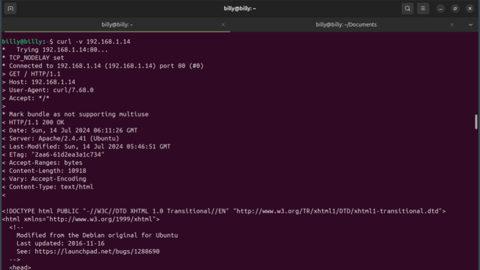
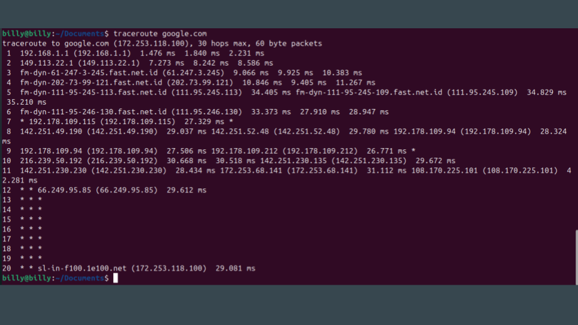

# **Footprinting** atau **Reconnaissance**

**Footprinting** atau **Reconnaissance** adalah tahap awal dalam proses keamanan siber yang bertujuan untuk mengumpulkan sebanyak mungkin informasi tentang target (misalnya, organisasi, sistem, atau jaringan) sebelum melakukan serangan atau penetrasi lebih lanjut. Informasi yang diperoleh selama tahap ini sangat penting untuk merencanakan serangan yang efektif atau, dalam konteks keamanan yang baik, untuk memperkuat pertahanan sistem.

### Tujuan Footprinting/Reconnaissance

1. **Mengidentifikasi Target**: Menentukan apa yang akan diserang, termasuk jaringan, server, aplikasi, dan perangkat lain yang terlibat.
2. **Mengumpulkan Informasi**: Mendapatkan data tentang struktur jaringan, sistem operasi yang digunakan, aplikasi yang berjalan, dan potensi kerentanan.
3. **Memahami Infrastruktur**: Mempelajari bagaimana berbagai komponen dalam sistem terhubung dan berinteraksi.
4. **Mempersiapkan Serangan**: Menyusun strategi serangan berdasarkan informasi yang dikumpulkan untuk memaksimalkan efektivitas dan mengurangi risiko terdeteksi.

### Metode Footprinting/Reconnaissance

Footprinting dapat dilakukan melalui dua pendekatan utama:

1. **Passive Footprinting (Rekognisi Pasif)**:

   - **Pengumpulan Informasi Publik**: Menggunakan sumber daya yang tersedia secara publik seperti situs web perusahaan, media sosial, pendaftaran domain, dan laporan tahunan.
   - **Pemantauan Lalu Lintas Jaringan**: Mengamati lalu lintas jaringan tanpa berinteraksi langsung dengan target, misalnya melalui mesin pencari atau database publik.
   - **Analisis Metadata**: Mengkaji metadata dari dokumen atau file yang dapat memberikan informasi tersembunyi tentang sistem atau jaringan target.
2. **Active Footprinting (Rekognisi Aktif)**:

   - **Pemindaian Jaringan (Network Scanning)**: Menggunakan alat seperti Nmap untuk memetakan jaringan, menemukan port terbuka, dan mengidentifikasi layanan yang berjalan.
   - **Enumerasi**: Menggali informasi lebih dalam tentang sistem operasi, pengguna, dan sumber daya jaringan melalui interaksi langsung dengan target.
   - **Penggunaan Teknik Sosial**: Mencari informasi melalui interaksi langsung dengan karyawan atau pengguna target, misalnya melalui phishing atau teknik rekayasa sosial lainnya.

### Alat yang Digunakan

Beberapa alat populer yang digunakan dalam proses footprinting meliputi:

- **Nmap**: Untuk pemindaian jaringan dan identifikasi port terbuka.
- **WHOIS**: Untuk mendapatkan informasi pendaftaran domain.
- **Nslookup/Dig**: Untuk memeriksa informasi DNS.
- **Google Dorking**: Teknik pencarian lanjutan menggunakan Google untuk menemukan informasi spesifik tentang target.
- **Maltego**: Untuk analisis hubungan dan penggambaran data yang kompleks.

### Pentingnya Footprinting

Footprinting adalah langkah krusial baik bagi penyerang maupun profesional keamanan siber. Bagi penyerang, tahap ini memungkinkan mereka untuk merencanakan serangan yang lebih efektif dan menyasar titik lemah sistem target. Bagi profesional keamanan, memahami teknik footprinting membantu dalam mengidentifikasi potensi ancaman dan memperkuat sistem untuk mencegah serangan.

### Contoh Praktik:

#### Passive Footprinting:

Dorking adalah teknik dalam *passive footprinting* yang menggunakan mesin pencari untuk melakukan  *information gathering* . Teknik ini memanfaatkan kemampuan mesin pencari seperti Google, DuckDuckGo, Bing, dan lainnya untuk menemukan informasi sensitif atau data yang tersembunyi namun dapat diakses secara publik di internet.

### Langkah-langkah Dorking:

1. **Pilih Mesin Pencari** : Gunakan mesin pencari yang tersedia, seperti Google, DuckDuckGo, atau Bing, tergantung pada kebutuhan dan preferensi.
2. **Mencari Data yang Tersedia** : Dengan menggunakan teknik dorking, kita bisa menemukan informasi seperti kontak, alamat, atau jenis layanan yang disediakan oleh target, dan detail lainnya yang mungkin berguna untuk proses lebih lanjut.
3. **Format Dorking** : Dorking biasanya menggunakan query atau kata kunci spesifik yang bisa mengungkap data sensitif. Contoh sederhana:

* **Target** : `example.com`
* **Contoh Query Dorking** : `berita.php?id= site:example.com`

Pada contoh ini, kita mencari halaman yang mengandung kata "berita.php?id=" di situs yang domainnya `example.com`. Ini bisa berguna untuk menemukan halaman-halaman yang mungkin rentan terhadap SQL injection atau menunjukkan parameter tertentu yang terbuka.

#### Active Footprinting

Setelah itu, kita dapat langsung mengakses situs web target untuk melakukan  *scanning* . Langkah pertama yang bisa dilakukan adalah menggunakan `curl` untuk melihat respons yang diterima saat mengirimkan permintaan ( *requests* ). Dengan menggunakan `curl`, kita dapat menganalisis berbagai informasi yang dikembalikan oleh server, seperti status HTTP, header, dan konten respons.

Jalankan perintah berikut untuk mendapatkan detail respons:

`curl -v [IP VM] `

Penjelasan:

* `curl`: Alat baris perintah yang digunakan untuk mengirimkan permintaan HTTP ke sebuah server.
* `-v`: Opsi ini mengaktifkan  *verbose mode* , yang menampilkan detail dari proses komunikasi, termasuk header yang dikirim dan diterima.
* `[IP VM]`: Ganti dengan IP atau host dari *virtual machine* (VM) target yang ingin Anda analisis.

---

**Trace Route**

* *Trace route* digunakan untuk melacak jalur yang ditempuh oleh paket data dari komputer pengguna ke server target. Ini membantu dalam mengetahui rute jaringan dan titik-titik perantara (router) yang dilalui.
* Perintah yang digunakan:
  * Di Linux: `traceroute [HOST / IP]`
  * Di Windows: `tracert [HOST / IP]`

Ini termasuk ke dalam *active footprinting* karena mengirimkan paket ICMP atau UDP ke target untuk mengetahui rute yang ditempuh, sehingga ada interaksi langsung dengan jaringan target.

### Kesimpulan

Footprinting atau reconnaissance adalah proses pengumpulan informasi awal yang esensial dalam keamanan siber. Dengan memahami teknik dan metode yang digunakan dalam footprinting, organisasi dapat meningkatkan keamanan mereka dengan mengidentifikasi dan menutup celah potensial sebelum dimanfaatkan oleh pihak yang tidak bertanggung jawab.
