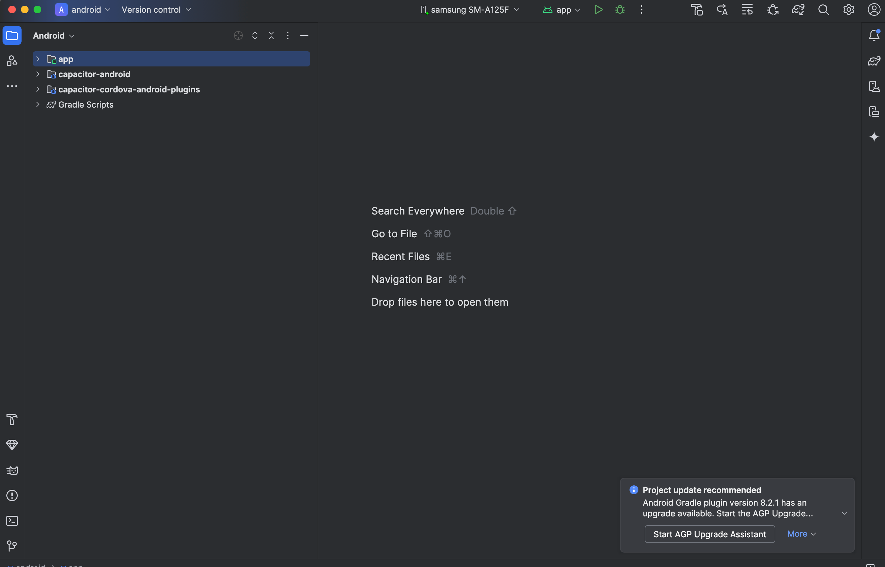
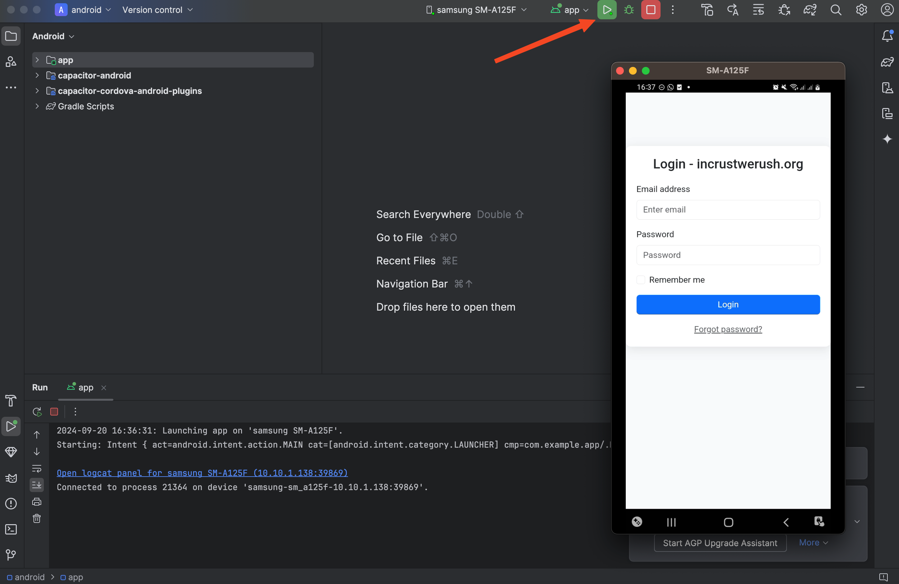
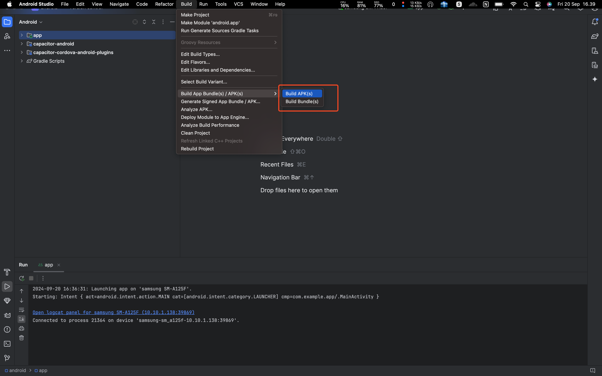
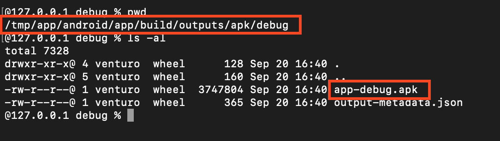

# Capacitor

**Written By Afrizal F.A**

## Requirements

- npm
- Android Studio

### Directory Structure

```
app/
├── www/
│   ├── index.html
│   ├── style.css
│   └── app.js
```

HTML Code

```html
<!DOCTYPE html>
<html lang="en">
<head>
    <meta charset="UTF-8">
    <meta name="viewport" content="width=device-width, initial-scale=1.0">
    <title>Login Page - incrustwerush.org</title>
    <link rel="stylesheet" href="https://cdn.jsdelivr.net/npm/bootstrap@5.3.3/dist/css/bootstrap.min.css">
    <style>
        body {
            background-color: #f8f9fa;
        }
        .login-container {
            max-width: 400px;
            margin: 100px auto;
            padding: 20px;
            background-color: #ffffff;
            border-radius: 10px;
            box-shadow: 0 4px 20px rgba(0, 0, 0, 0.1);
        }
        .login-header {
            text-align: center;
            margin-bottom: 20px;
        }
    </style>
</head>
<body>
    <div class="login-container">
        <h2 class="login-header">Login - incrustwerush.org</h2>
        <form>
            <div class="mb-3">
                <label for="email" class="form-label">Email address</label>
                <input type="email" class="form-control" id="email" placeholder="Enter email" required>
            </div>
            <div class="mb-3">
                <label for="password" class="form-label">Password</label>
                <input type="password" class="form-control" id="password" placeholder="Password" required>
            </div>
            <div class="mb-3 form-check">
                <input type="checkbox" class="form-check-input" id="rememberMe">
                <label class="form-check-label" for="rememberMe">Remember me</label>
            </div>
            <button type="submit" class="btn btn-primary w-100">Login</button>
        </form>
        <div class="text-center mt-3">
            <a href="#" class="text-muted">Forgot password?</a>
        </div>
    </div>
    <script src="https://cdn.jsdelivr.net/npm/bootstrap@5.3.3/dist/js/bootstrap.bundle.min.js"></script>
</body>
</html>

```

### Enter to project directory

```bash
cd app
```

### NPM Installation

```bash
brew install npm node
```

### NPM init

```bash
npm init -y
```

### Install Capacitor Android

```bash
npm install @capacitor/core @capacitor/cli @capacitor/android
```

### Initial Capacitor

```bash
npx cap init
```

### Add Platform

```bash
npx cap add android
```

### Change Structure

```
app/
├── www/
│   ├── index.html
│   ├── style.css
│   └── app.js
├── package.json
└── capacitor.config.ts (atau .json)
```

### Copy Capasitor

```bash
npx cap copy android
```

### Capasitor Open ( Android Studio Build / Run )

```bash
npx cap open android
```



### Run



### Build



Result


