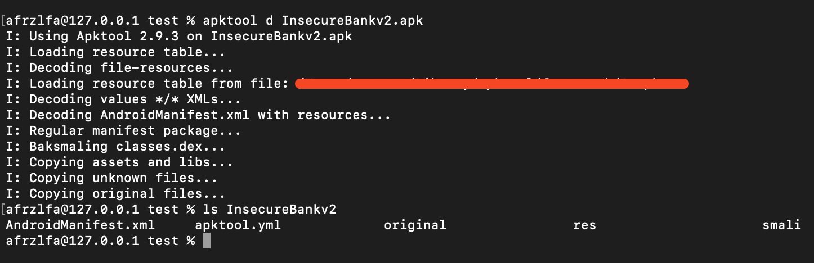
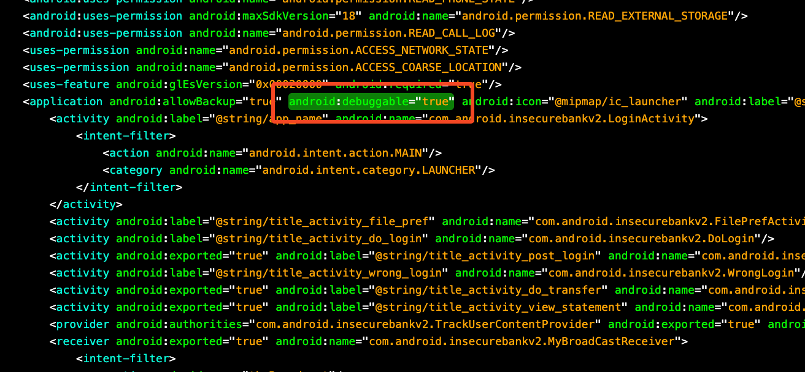
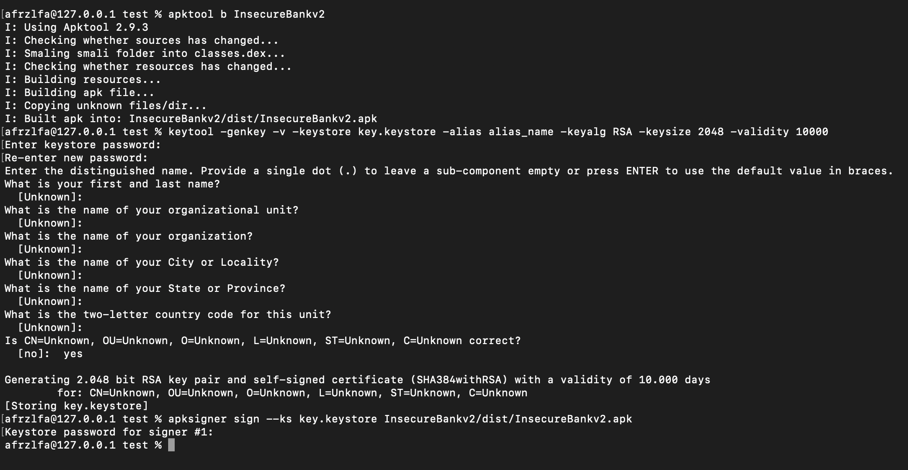
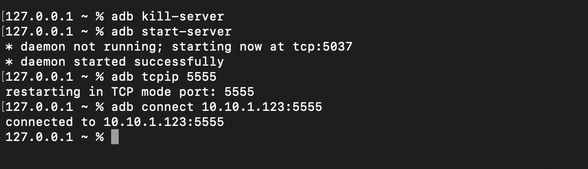
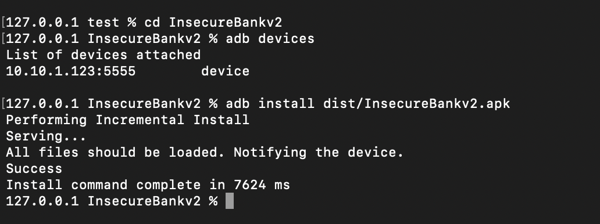
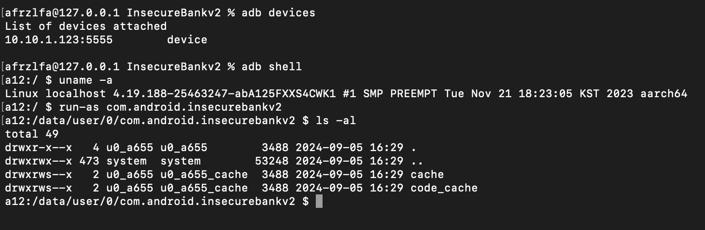
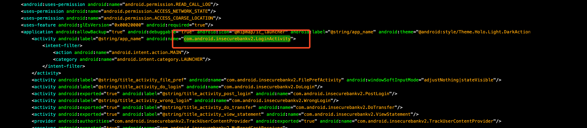

# Debuggable APK

**Written By Afrizal F.A - R&D incrustwerush.org**

## Preparation

Before performing techniques for debugging an APK, please make sure that Developer Mode and USB Debugging are enabled on your Android device. You can enable Developer Mode by navigating to Settings > About Phone and tapping on the Build Number several times. Then, go to Settings > Developer Options and activate USB Debugging. This setup is essential for successful interaction and debugging of the APK.

## Decompile APK

Install apktool, apksigner, keytool

```bash
apktool d <apk-name>.apk
ls <apk-name> # For check directory
```



## Edit file `AnrdoidManifest.xml`

Add `android:debuggable="true"` to application tag



## Recompile APK

```bash
apktool b <apk-name-directory>
keytool -genkey -v -keystore key.keystore -alias alias_name -keyalg RSA -keysize 2048 -validity 10000
apksigner sign --ks key.keystore <apk-name-directory>/dist/<apk-name>.apk
```



## Restart adb server & connect

Command:

```bash
adb kill-server
adb start-server
adb tcpip 5555 # With IP
adb connect <IP>:<PORT> # Connect With IP
```



## Install APK

Command:

```bash
cd <apk-name-directory>
adb devices # Check Connection
adb install dist/<apk-name>.apk
```



## ADB Shell: Connect and Access APK Data Directory

Enter Shell

```bash
adb devices
adb shell
# Android Shell
uname -a
run-as <package-directory>
ls -al
```



Package Directory on `AndroidManifest.xml`


