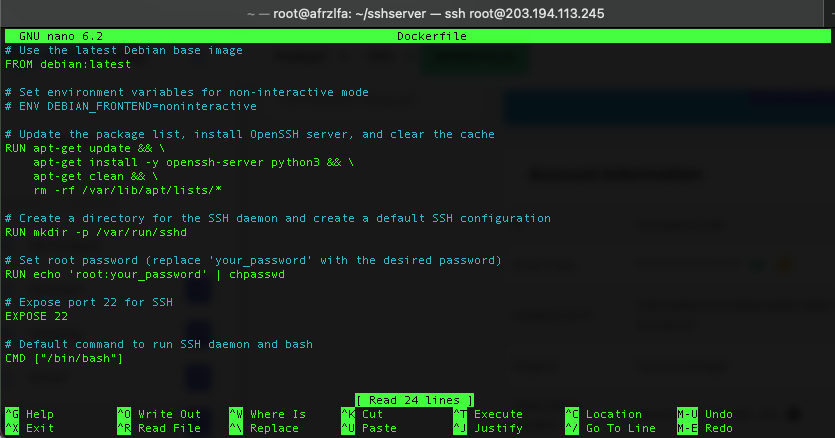
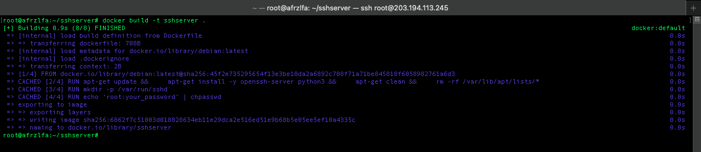
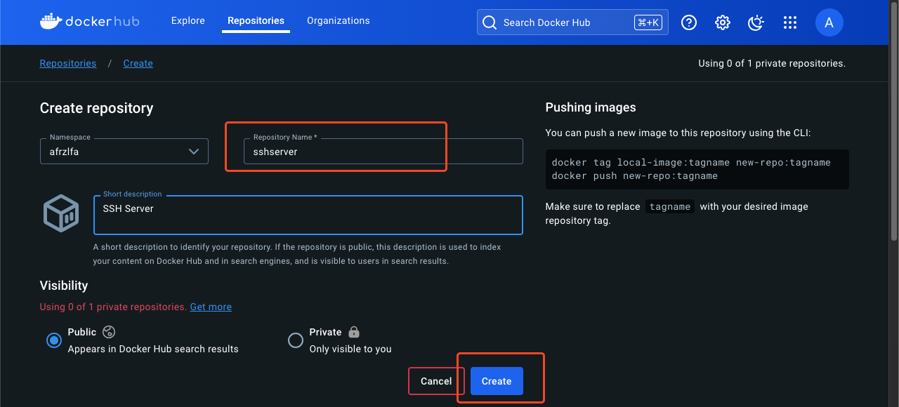
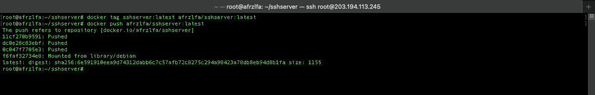
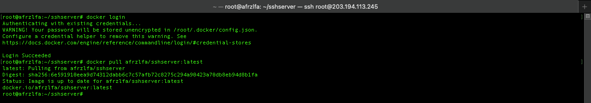
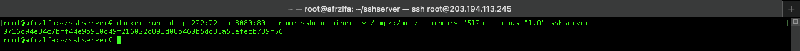

# Docker

## Create Dockerfile Basic

```bash
mkdir sshserver
cd sshserver
nano Dockerfile
```

Dockerfile

```plaintext
# Use the latest Debian base image
FROM debian:latest

# Set environment variables for non-interactive mode
# ENV DEBIAN_FRONTEND=noninteractive

# Update the package list, install OpenSSH server, and clear the cache
RUN apt-get update && \
    apt-get install -y openssh-server python3 && \
    apt-get clean && \
    rm -rf /var/lib/apt/lists/*

# Create a directory for the SSH daemon and create a default SSH configuration
RUN mkdir -p /var/run/sshd

# Set root password (replace 'your_password' with the desired password)
RUN echo 'root:your_password' | chpasswd

# Expose port 22 for SSH
EXPOSE 22

# Default command to run SSH daemon and bash
CMD ["/bin/bash"]

```



Build, Enter directory docker

```bash
docker build -t <image_name> .
```



Change image_name you will

## Create Docker Repository


Next



Push Docker

```bash
docker login

# docker tag <your_image>:<your_tag> <your_username>/<your_repository>:<your_tag>
docker tag sshserver:latest afrzlfa/sshserver:latest

# docker push <your_username>/<your_repository>:<your_tag>
docker push afrzlfa/sshserver:latest
```



Pull Docker

```bash
docker login

# docker pull <your_username>/<your_repository>:<your_tag>
docker pull afrzlfa/sshserver:latest
```



Docker Run

```
# docker run -d -p <docker_host>:<docker_port> --name <container_name> -v <volume_host>:<directory_docker> --memory="<RAM, Example 512m>" --cpus="<CPU Core, Example: 1.0>" <image_name>

docker run -d -p 222:22 -p 8080:80 --name sshcontainer -v /tmp/:/mnt/ --memory="512m" --cpus="1.0" sshserver
```




## Create Docker DCT

```bash
mkdir sshserver
cd sshserver
nano Dockerfile
```

Dockerfile

```plaintext
# Use the latest Debian base image
FROM debian:latest

# Set environment variables for non-interactive mode
# ENV DEBIAN_FRONTEND=noninteractive

# Update the package list, install OpenSSH server, and clear the cache
RUN apt-get update && \
    apt-get install -y openssh-server python3 && \
    apt-get clean && \
    rm -rf /var/lib/apt/lists/*

# Create a directory for the SSH daemon and create a default SSH configuration
RUN mkdir -p /var/run/sshd

# Set root password (replace 'your_password' with the desired password)
RUN echo 'root:your_password' | chpasswd

# Expose port 22 for SSH
EXPOSE 22

# Default command to run SSH daemon and bash
CMD ["/bin/bash"]
```

Docker Command

```bash
docker trust key generate <your_username>
docker trust signer add --key <your_username>.pub <your_username> <your_username>/<your_repository>
# docker trust key load <your_username>.pub --name <your_username>
# docker trust signer remove <your_username> <your_repository>
docker trust inspect --pretty <your_repository>
```

Setting Environment Build

```bash
export DOCKER_CONTENT_TRUST=1
```

Build

```bash
docker build -t <your_username>/<your_repository>:<your_tag> .
```

Push docker

```bash
docker login

# docker tag <your_image>:<your_tag> <your_username>/<your_repository>:<your_tag>
docker tag sshserver:latest afrzlfa/sshserver:latest

# docker push <your_username>/<your_repository>:<your_tag>
docker push afrzlfa/sshserver:latest
```

Pull Docker

```bash
docker images
docker rmi -f <image-id>

docker login

# docker pull <your_username>/<your_repository>:<your_tag>
docker pull afrzlfa/sshserver:latest

```

Environment

```bash
# For Check Repository Key
# docker trust inspect --pretty <your_repository>
export ENCODED_PASSPHRASE=$(cat ~/.docker/trust/private/<your_repository_key>.key | base64)
export DOCKER_CONTENT_TRUST_REPOSITORY_PASSPHRASE=$ENCODED_PASSPHRASE
```

Docker Push

```bash
docker login

# docker tag <your_image>:<your_tag> <your_username>/<your_repository>:<your_tag>
docker tag sshserver:latest afrzlfa/sshserver:latest

# docker push <your_username>/<your_repository>:<your_tag>
docker push afrzlfa/sshserver:latest

```

Docker Pull

```bash
docker login
docker pull <your_username>/<your_repository>:<your_tag>
```

Docker Run

```
# docker run -d -p <docker_host>:<docker_port> --name <container_name> -v <volume_host>:<directory_docker> --memory="<RAM, Example 512m>" --cpus="<CPU Core, Example: 1.0>" <image_name>

docker run -d -p 222:22 -p 8080:80 --name sshcontainer -v /tmp/:/mnt/ --memory="512m" --cpus="1.0" sshserver
```

## Access Docker Shell

```bash
docker ps
# docker exec -it <container_id_or_name> /bin/bash
docker exec -it sshserver /bin/bash
```
