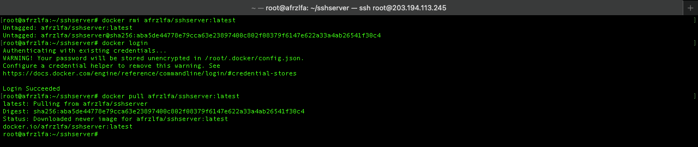

# Docker

Written By Afrizal F.A

## Create Dockerfile Basic

```bash
mkdir sshserver
cd sshserver
nano Dockerfile
```


Dockerfile

```plaintext
FROM ubuntu:latest

# Instalasi OpenSSH server
RUN apt-get update && apt-get install -y openssh-server

RUN mkdir /var/run/sshd

# Change 'password' for your password
RUN echo 'root:password' | chpasswd

RUN sed -i 's/#PermitRootLogin prohibit-password/PermitRootLogin yes/' /etc/ssh/sshd_config

RUN sed -i 's/#GatewayPorts no/GatewayPorts yes/' /etc/ssh/sshd_config

EXPOSE 22

CMD ["/usr/sbin/sshd", "-D"]
```


Build, Enter directory docker

```bash
# docker build -t <image_name> .
docker build -t sshserver .
```


Change image_name you will

## Create Docker Repository


Next


Push Docker

```bash
docker login

# docker tag <your_image>:<your_tag> <your_username>/<your_repository>:<your_tag>
docker tag sshserver:latest afrzlfa/sshserver:latest

# docker push <your_username>/<your_repository>:<your_tag>
docker push afrzlfa/sshserver:latest
```


Pull Docker

```bash
# If already exist
# docker rmi afrzlfa/sshserver:latest
docker login
# docker pull <your_username>/<your_repository>:<your_tag>
docker pull afrzlfa/sshserver:latest
```



Docker Run

```
# docker run -d -p <docker_host>:<docker_port> --name <container_name> -v <volume_host>:<directory_docker> --memory="<RAM, Example 512m>" --cpus="<CPU Core, Example: 1.0>" <image_name>

docker run -d -p 222:22 -p 8080:80 --name sshcontainer -v /tmp/:/mnt/ --memory="512m" --cpus="1.0" sshserver
# If already in use
# docker remove sshcontainer
```


Check Docker

```bash
docker ps
```


Login to container ssh

```bash
ssh root@<ip> -p 222
```

Running Pyhton Server

```bash
python3 -m http.server 80
```


Open Browser http://203.194.113.245:8080


## Create Docker DCT

```bash
mkdir ssh-dct
cd ssh-dct
nano Dockerfile
```

Dockerfile

```plaintext
FROM ubuntu:latest

# Instalasi OpenSSH server
RUN apt-get update && apt-get install -y openssh-server

RUN mkdir /var/run/sshd

# Change 'password' for your password
RUN echo 'root:password' | chpasswd

RUN sed -i 's/#PermitRootLogin prohibit-password/PermitRootLogin yes/' /etc/ssh/sshd_config

RUN sed -i 's/#GatewayPorts no/GatewayPorts yes/' /etc/ssh/sshd_config

EXPOSE 22

CMD ["/usr/sbin/sshd", "-D"]

```

Create Docker Repository


Next


Docker Command

```bash
# docker trust key generate <your_username>
docker trust key generate afrzlfa
# docker trust signer add --key <your_username>.pub <your_username> <your_username>/<your_repository>:<your_tag>
docker trust signer add --key afrzlfa.pub afrzlfa afrzlfa/ssh-dct:latest
# docker trust key load <your_username>.pub --name <your_username>
# docker trust signer remove <your_username> <your_repository>
# docker trust inspect --pretty <your_repository>
docker trust inspect --pretty afrzlfa/ssh-dct:latest
```


Setting Environment Build

```bash
export DOCKER_CONTENT_TRUST=1
```

Build

```bash
# docker build -t <your_username>/<your_repository>:<your_tag> .
docker build -t afrzlfa/ssh-dct:latest .
```


Push docker

```bash
docker login

# docker tag <your_image>:<your_tag> <your_username>/<your_repository>:<your_tag>
docker tag afrzlfa/ssh-dct:latest afrzlfa/ssh-dct:latest

# docker push <your_username>/<your_repository>:<your_tag>
docker push afrzlfa/ssh-dct:latest

```


Pull Docker

```bash
# If images already exist
# docker images
# docker rmi <image_id_or_name>
# docker prune

docker login

# docker pull <your_username>/<your_repository>:<your_tag>
docker pull afrzlfa/ssh-dct:latest

```

Environment

```bash
# For Check Repository Key
# docker images
# docker trust inspect --pretty <your_repository>
export ENCODED_PASSPHRASE=$(cat ~/.docker/trust/private/<your_repository_key>.key | base64)
export DOCKER_CONTENT_TRUST_REPOSITORY_PASSPHRASE=$ENCODED_PASSPHRASE
```


Docker Push

```bash
docker login

# docker tag <your_image>:<your_tag> <your_username>/<your_repository>:<your_tag>
docker tag afrzlfa/ssh-dct:latest afrzlfa/ssh-dct:latest

# docker push <your_username>/<your_repository>:<your_tag>
docker push afrzlfa/ssh-dct:latest

```


Docker Pull

```bash
docker login
# docker pull <your_username>/<your_repository>:<your_tag>
docker pull afrzlfa/ssh-dct:latest
```


Docker Run

```
# docker run -d -p <docker_host>:<docker_port> --name <container_name> -v <volume_host>:<directory_docker> --memory="<RAM, Example 512m>" --cpus="<CPU Core, Example: 1.0>" <image_name>

docker run -d -p 222:22 -p 8080:80 --name sshdct -v /tmp/:/mnt/ --memory="512m" --cpus="1.0" afrzlfa/ssh-dct:latest
# If already in use
# docker remove sshdct
```


## Access Docker Shell

```bash
docker ps
# docker exec -it <container_id_or_name> /bin/bash
docker exec -it afrzlfa/dct-ssh:latest /bin/bash
# If success, enter to shell docker container
```


